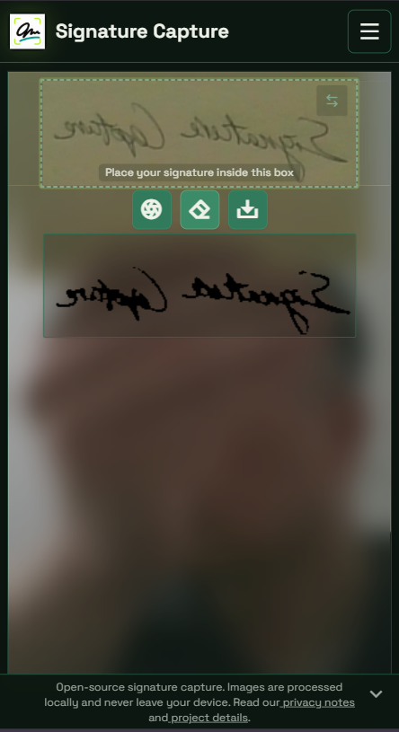
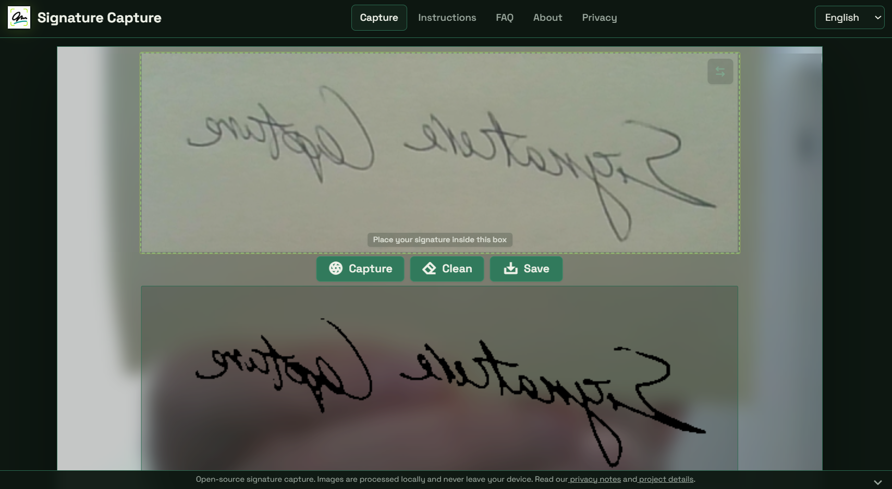
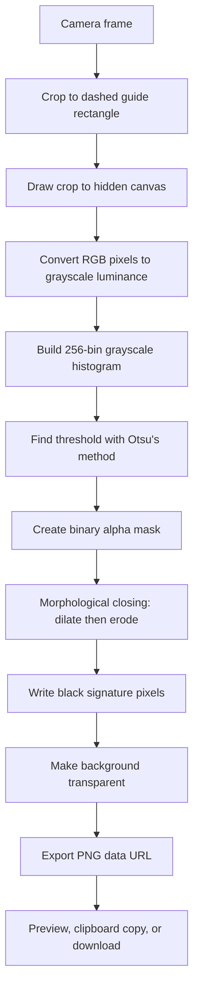

# Signature Capture

[](./LICENSE)
[](https://developers.cloudflare.com/workers/static-assets/)

Open-source browser app for turning a handwritten signature into a transparent PNG.

The app uses your camera, crops the signature guide area, removes the paper background in the browser, and lets you download the cleaned image. Captured images are not uploaded.

This repository contains the React/Vite app and the Cloudflare Workers Static Assets deployment configuration.

- Live app: https://signature.codeant.studio/
- Canonical URL: https://signature.codeant.studio/
- Runtime: Cloudflare Workers Static Assets serving the Vite build from `dist`

## What is Signature Capture?

Signature Capture is a free open source signature background remover. It uses your phone or desktop camera to capture a handwritten signature on paper, removes the paper background in the browser, and exports a transparent PNG image.

Your signature image is processed locally in your browser. No account is required, and the captured image is not uploaded to a server.

## Index

- [What is Signature Capture?](#what-is-signature-capture)
- [Features](#features)
- [Screenshots](#screenshots)
- [Tech Stack](#tech-stack)
- [Image Processing Algorithm](#image-processing-algorithm)
- [Development](#development)
- [Local Test Environment](#local-test-environment)
- [Build](#build)
- [Deploy](#deploy)
- [Privacy Model](#privacy-model)
- [Contributing](#contributing)
- [License](#license)

## Features

- Local camera capture
- Camera selector for available video devices
- Automatic preference for sharper mobile/desktop cameras
- Browser-side background cleanup
- PNG download and clipboard copy
- SPA routing on Cloudflare Workers Static Assets
- Preview aliases for branch deployments

## Screenshots

### Mobile



### Desktop



## Tech Stack

- React 19
- TypeScript
- Vite
- React Router
- React Helmet Async
- Tailwind CSS
- PostCSS and Autoprefixer
- ESLint with React Hooks rules
- Cloudflare Workers Static Assets
- Wrangler

## Image Processing Algorithm

The cleanup algorithm lives in `src/core/imageProcessing.ts`. It is intentionally small, deterministic, and browser-only so signature images never need to leave the user's device.



### Processing Steps

| Step | Purpose | Implementation |
| --- | --- | --- |
| Guide crop | Limits processing to the signature area selected by the user. | `SignatureCapture.tsx` maps the dashed guide rectangle from the displayed video element back to source video pixels, then draws that crop to a hidden canvas. |
| Grayscale conversion | Reduces RGB camera data to one intensity value per pixel. | Uses integer luminance weights: `0.299 R + 0.587 G + 0.114 B`. |
| Histogram | Counts how many pixels occur at each grayscale level from 0 to 255. | A 256-bin array is built from the cropped canvas data. |
| Otsu threshold | Separates dark ink from lighter paper/background without a manually tuned fixed threshold. | The code searches for the grayscale threshold that maximizes between-class variance. |
| Binary alpha mask | Removes paper by making light pixels transparent. | Pixels darker than the threshold receive alpha `255`; lighter pixels receive alpha `0`. |
| Morphological closing | Reconnects small stroke breaks caused by noise, glare, or paper texture. | A 3x3 dilation pass is followed by a 3x3 erosion pass over the alpha mask. |
| Black-and-transparent output | Produces a simple downstream-friendly PNG. | Visible signature pixels are written as black RGB; background pixels are transparent. Original camera colors are discarded. |

The result is a transparent PNG with black signature strokes. This is useful for form overlays and other document workflows because the output is already binarized and does not carry paper color, lighting gradients, or camera color casts.

### Algorithm Notes

- The threshold is global for the cropped signature region. It works best when the dashed guide contains mostly paper and ink, not a large amount of unrelated background.
- The cleanup is designed for dark ink on lighter paper. Very light pencil marks, low contrast writing, or strong shadows may need better lighting or a recapture.
- The morphological closing uses a fixed 3x3 neighborhood. That keeps the implementation fast and dependency-free, but it is intentionally conservative.
- All processing happens with Web APIs: `<video>`, `<canvas>`, `ImageData`, and `toDataURL('image/png')`.

References:

- Nobuyuki Otsu, "A Threshold Selection Method from Gray-Level Histograms", IEEE Transactions on Systems, Man, and Cybernetics, 1979. DOI: https://doi.org/10.1109/TSMC.1979.4310076
- Luminance weights follow the common Rec. 601-style grayscale approximation used for RGB-to-luma conversion.

## Development

```bash
npm install
npm run dev
```

## Local Test Environment

Use dedicated local ports for this project so it does not collide with other apps running on your machine.

Run the automated test suite:

```bash
npm test
```

Run the Vite development server:

```bash
npm run dev -- --host 127.0.0.1 --port 5174 --strictPort
```

Open:

```text
http://127.0.0.1:5174/
```

Test the production build locally:

```bash
npm run build
npm run preview -- --host 127.0.0.1 --port 4174 --strictPort
```

Open:

```text
http://127.0.0.1:4174/
```

## Build

```bash
npm run build
```

## Deploy

```bash
npm run deploy
```

Cloudflare Web Analytics is opt-in for deployments. Set
`VITE_CLOUDFLARE_ANALYTICS_TOKEN` in the deployment environment to load the
beacon on public hostnames; localhost previews skip it even when a token exists.

## Privacy Model

Signature images are processed locally in the browser. The app does not require an account and does not send captured images to a server.

Open-source hygiene notes:

- Do not commit generated secrets, VAPID private keys, API tokens, `.env` files, or Cloudflare credentials.
- `vapid-keys.json`, `.env`, and `.env.*` are ignored by Git.
- The public deployment URL is not a secret credential.

## Contributing

Contributions are welcome. Please read [CONTRIBUTING.md](./CONTRIBUTING.md) before opening a pull request.

For security or privacy concerns, do not open a public issue. Follow [SECURITY.md](./SECURITY.md) instead.

## License

This project is licensed under the MIT License. See [LICENSE](./LICENSE) for details.
